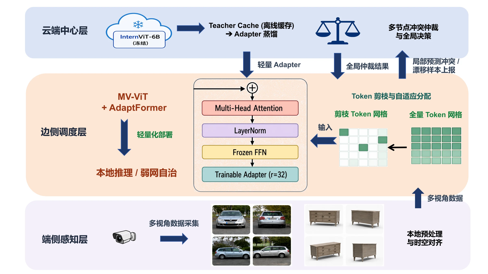

# EdgeCloud

> 面向端边云协同推理的分布式感知与全局优化决策系统<br>
> 2026 挑战杯“揭榜挂帅”擂台赛 · 赛题 XH-202606

[在线演示](https://cywang0207.github.io/EdgeCloud-Demo/) · [项目宣传片](submission/作品运行效果视频.mp4) · [作品报告](submission/作品报告.pdf) · [最新 Release](https://github.com/CYWang0207/EdgeCloud/releases/latest) · [提交材料入口](README_FIRST.md)

EdgeCloud 面向交通监控与多视角三维物体识别两类场景，在边缘侧使用冻结的 MV-ViT-Small 完成实时推理，在检测到合成相机漂移后，由云端冻结的 InternViT-6B 视觉教师生成监督信号，仅训练并下发约 1.2 MB 的 AdaptFormer 参数包。Actor-Critic、Lyapunov 队列和多节点仲裁共同完成弱网调度与全局决策。

> 项目中的 illumination、motion blur、defocus 和 sensor noise 均为在公开数据集上生成并校准的**合成相机退化**，用于可控评测，不宣称为真实道路连续采集实验。

## 总体架构



```text
多视角采集 → 边缘 MV-ViT 实时感知 → 漂移检测
  → 代表性漂移样本上行 → 云端 InternViT-6B 教师蒸馏
  → Adapter-only 参数下发 → 边缘热加载与恢复
  → 多节点冲突检测、仲裁和结果回写
```

## 核心指标

| 指标 | 赛题要求 | EdgeCloud 结果 | 口径 |
|---|---:|---:|---|
| TTFT 降低 | ≥75% | 88.5%（287 ms → 38 ms） | GPU 基准测试，Token 保留率 0.1 |
| 单次推理内存 | ≤1.5 GB | 约 0.08 GB | GPU 推理峰值，不含框架初始化 |
| ModelNet40 三类漂移平均准确率 | - | 87.318% → 93.247% | 完整 official test，2,468 条 |
| BoxCars 三类漂移平均准确率 | - | 74.46% → 79.02% | 完整 official test，12,322 条 |
| 弱网业务保持率 | ≥90% | 90.28%–90.32% | 四档网络仿真 |
| 前台端到端时延 | ≤200 ms | 80 ms；含 Adapter 前台下发为 92–111 ms | 网络仿真；`T_edge=80 ms` 为固定参数 |
| 多节点决策冲突率 | ≤5% | 4.06% | BoxCars 完整 test 仿真 |
| 冲突解决成功率 | ≥90% | 100% | 加权投票与贝叶斯融合 |
| Adapter 下发量 | - | 约 1.2 MB | 299,916 个 AdaptFormer 参数 |

详细定义、样本量和证据边界见[实验结果总览](docs/实验结果总览_20260809.md)。其中 80 ms、92–111 ms 为网络模拟器结果，并非真实信创边缘硬件的 wall-clock 测量。

## 主要提交路线

1. 边缘端冻结 22M 参数 MV-ViT-Small 主干，使用多视角融合、视角掩码和 Token 剪枝完成本地推理。
2. 漂移超过阈值后，仅上传少量代表性四视图轨迹；上传样本在正式 refresh 阶段不使用真实标签。
3. 云端冻结 InternViT-6B，通过 task logits、视觉特征和 clean replay 训练约 0.3M 参数 AdaptFormer。
4. 边缘只接收 Adapter-only checkpoint，支持热加载、完整性校验和回滚。
5. 调度器在 `u_t∈{0,1,2}`、视角选择和 Token 保留率之间联合决策；断网时回退至 `u=0` 本地自治。
6. 多节点对重叠感知结果执行冲突检测、加权投票或贝叶斯融合，并回写全局决策。

## 两类实验场景

### ModelNet40

一个样本由同一 CAD 物体的四个渲染视角组成。正式评测使用 illumination、defocus 和 sensor noise 三类合成退化，完整 official test 共 2,468 条四视图轨迹。

### BoxCars116k

任务为 16 类车辆品牌识别。四个输入是**同一物理交通摄像头下、同一车辆轨迹中按时间等间隔选取的四个逻辑视角**，不是四个物理摄像头同时追踪同一车辆。正式评测使用 illumination、motion blur 和 sensor noise 三类合成退化，完整 official test 共 12,322 条轨迹。

## 目录结构

```text
EdgeCloud/
├── module_edge_perception/    # MV-ViT、AdaptFormer、两场景训练与评测
├── module_scheduling/         # Actor-Critic、Lyapunov、网络韧性、多节点仲裁
├── common/                    # 合成漂移与公共数据接口
├── docs/                      # 方法、接口和正式实验报告
├── demo-web/                  # 可离线打开的交互演示网页
├── submission/                # 作品报告与运行效果视频
├── data/                      # 数据获取和目录说明
├── models/                    # 权重清单和 Release 获取说明
├── scripts/                   # 环境验证与复现辅助脚本
├── README_FIRST.md            # 评委阅读入口
├── REPRODUCE.md               # 统一复现导航
└── SUBMISSION_MANIFEST.md     # 提交材料清单
```

## 5 分钟快速体验

### 环境验证

所需文件：无数据集、无训练 checkpoint。首次安装依赖需要联网。

```bash
git clone https://github.com/CYWang0207/EdgeCloud.git
cd EdgeCloud
python3.11 -m venv .venv
source .venv/bin/activate                # Windows: .venv\Scripts\activate
python -m pip install -r requirements.txt
python scripts/verify_env.py
```

预期输出：构建随机初始化的 ViT-Small，依次完成四视图推理、Token 剪枝、视角休眠和 CPU 参考计时。需要验证 ImageNet 预训练权重时增加 `--pretrained`。

### Web Demo

所需文件：仓库中的 `demo-web/`，无需模型和数据集。

```bash
python -m http.server 8000 --directory demo-web
```

浏览器访问 <http://localhost:8000>。预期结果：可切换 BoxCars/ModelNet40 场景与漂移类型，并回放 15 秒端边云流程。15 秒是展示时间轴，不代表真实执行耗时。

## 正式实验复现

以下命令假设已按 [models/README.md](models/README.md) 和 [data/README.md](data/README.md) 准备输入。完整参数、环境和输出解释见 [REPRODUCE.md](REPRODUCE.md)；四个入口统一读取 [configs/submission.yaml](configs/submission.yaml) 的同名默认约定，并允许 CLI 覆盖。

### ModelNet40 完整流程

```bash
python scripts/reproduce_modelnet40.py
```

预期输出：teacher gate、Adapter checkpoint、完整 test 指标和逐条件结果。需要 NVIDIA GPU、ModelNet40、边缘 baseline 和 InternViT-6B。

### BoxCars 完整评测

```bash
python scripts/reproduce_boxcars.py
```

预期输出：12,322 条 official test 的 clean/三类漂移准确率、paired bootstrap 置信区间和预测明细。该命令省略 6B teacher 参数，仅复核固定 Adapter 的最终结果。

### 网络韧性

```bash
python scripts/reproduce_network.py
```

预期输出：static、jitter、jitter_outage、markov 四档结果及业务保持率。此处 `T_edge=80 ms` 是固定仿真参数；Adapter 默认异步下发，不阻塞当前前台链路。

### 多节点冲突仲裁

```bash
python scripts/reproduce_multinode.py
```

增加 `--fusion bayesian` 可复现另一种仲裁。预期输出：冲突样本、仲裁结果、回滚记录和汇总指标。

## 实验文档

- [两场景实验结果总览](docs/实验结果总览_20260809.md)
- [ModelNet40 正式结果](docs/第一场景_ModelNet40.md)
- [BoxCars116k 正式结果](docs/第二场景_BoxCars116k.md)
- [网络波动模拟器设计与结果](docs/网络波动模拟器设计.md)
- [多节点冲突仲裁结果](docs/多节点冲突仲裁测试结果_20260811.md)
- [接口契约](docs/接口契约.md)

## 历史实验

Prompt tuning、监督漂移 Adapter、整模型重训以及 Qwen3-VL 条件注入均保留用于消融或历史对照，不属于当前正式推理链路。正式提交路线统一为“冻结 InternViT-6B 视觉教师 → 无标签 cloud refresh → Adapter-only 下发”。

## 团队

东南大学 EdgeCloud 项目组。团队成员与指导教师信息见[作品报告](submission/作品报告.pdf)。

## 许可与第三方材料

提交前请阅读 [LICENSE](LICENSE) 与 [THIRD_PARTY.md](THIRD_PARTY.md)。数据集、预训练模型和第三方代码分别遵循其原始许可证，本仓库不会通过项目许可证重新授权这些材料。
